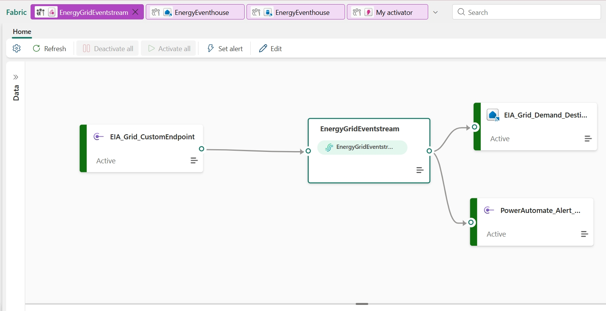
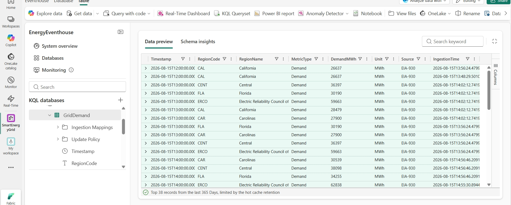
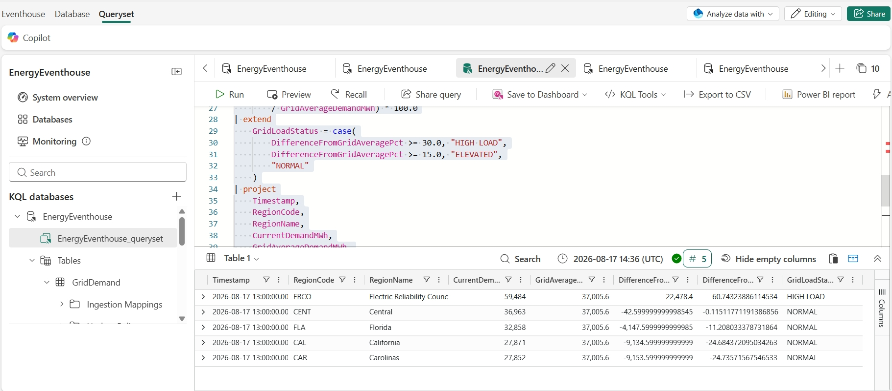
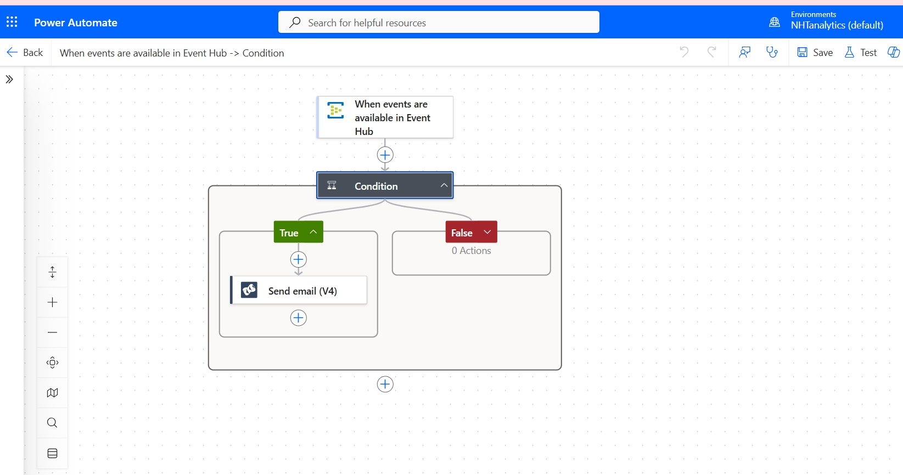
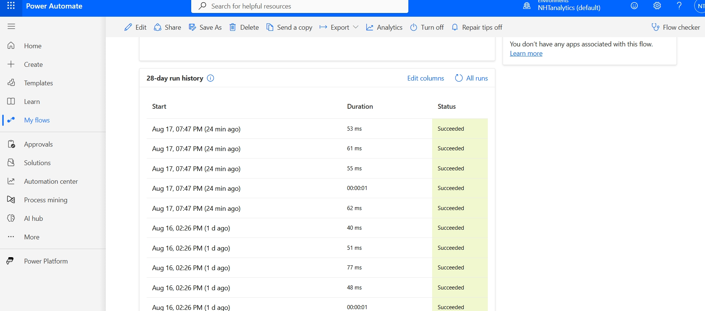
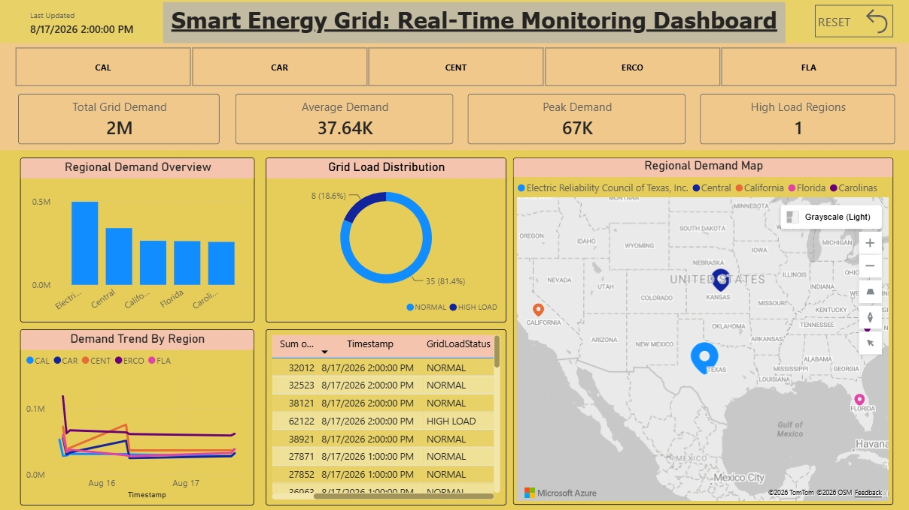
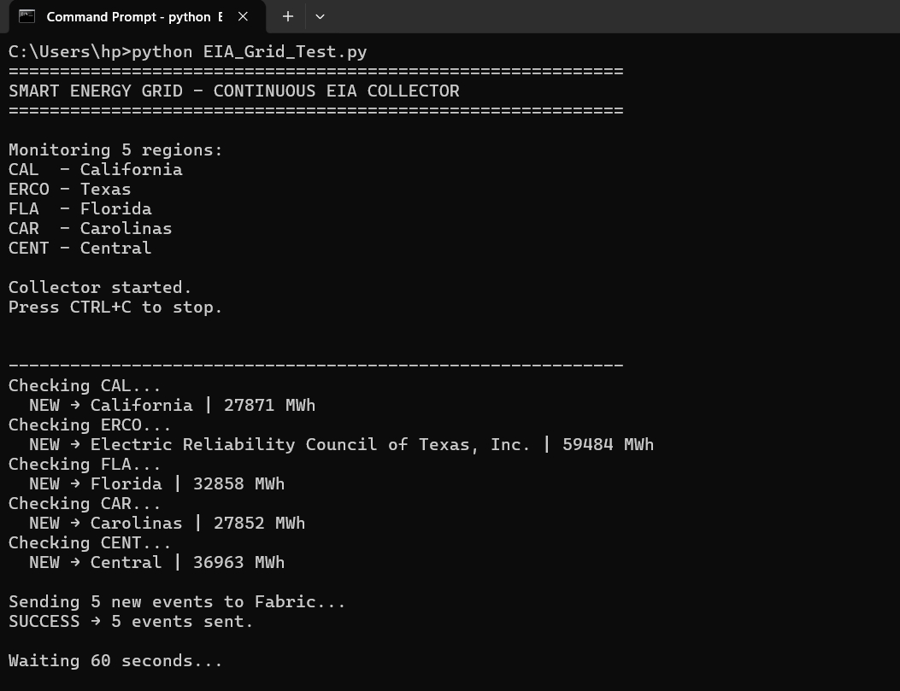

# Smart Energy Grid Monitoring System

Real-time U.S. electricity grid monitoring system built on Microsoft Fabric —
ingesting live EIA-930 demand data, detecting high-load conditions, and
triggering automated alerts, visualized in Power BI.

## Architecture

EIA API → Python Collector → Fabric Eventstream → Eventhouse (KQL) →
KQL Analytics → Power Automate (Event Hub trigger) → SendGrid Alert → Power BI Dashboard

## Features
- Real (not simulated) live electricity demand data from 5 U.S. grid regions
  (California, Texas, Florida, Carolinas, Central)
- Real-time ingestion via Microsoft Fabric Eventstream, deduped hourly per region
- KQL-based analytics: grid load % deviation, peak analysis, HIGH LOAD /
  ELEVATED / NORMAL classification
- Automated email alerts on high-load conditions — built independently via
  Power Automate + SendGrid after Fabric Data Activator's native email path
  was blocked by a tenant mailbox licensing limitation
- Live Power BI dashboard: KPI cards, regional map, trend lines, load
  distribution, live table

## Screenshots

**Real-time data landing in Eventhouse**

**KQL grid load classification query**

**Power Automate alert flow**

**All alert runs succeeding**

**Final dashboard**

**Live collector running**

## Tech Stack
Microsoft Fabric (Eventstream, Eventhouse, KQL), Python, Azure Event Hubs,
Power Automate, SendGrid, Power BI, DAX

## Data Source
U.S. Energy Information Administration (EIA) API — EIA-930 hourly electricity demand
https://api.eia.gov/v2/electricity/rto/region-data/data/

## Setup
1. Clone repo
2. `pip install requests azure-eventhub`
3. Set environment variables: `EIA_API_KEY`, `FABRIC_EVENTHUB_CONNECTION_STRING`
4. `python EIA_Grid_Test.py`

## Author
Neelakantha Talawar
